# SOC Dashboard Visualizer

This repository contains the source code for a SOC (Security Operations Center) dashboard visualizer. The application is built with Streamlit and provides real-time visualization of security alerts, integration with threat intelligence sources, and tools for incident response.

This project is a proof-of-concept demonstrating a SOC environment for educational purposes. It integrates several open-source security tools:

-   **SIEM:** Wazuh
-   **IDS:** Snort
-   **Threat Emulation:** MITRE Caldera
-   **Threat Intelligence:** MITRE ATT&CK

The dashboard helps in monitoring, analyzing, and responding to security events in a simulated network environment.

> **Disclaimer:** This is a student project and is **not** a production‑ready solution. It is intended for educational and research purposes to demonstrate a proof of concept with **one Windows target** and **one Linux host**.

## Table of Contents

- [Installation](#installation)
  - [Prerequisites](#prerequisites)
  - [Installation Steps](#installation-steps)
  - [Platform-Specific Notes](#platform-specific-notes)
- [How to set up your SOC? | Getting Started Manual](#how-to-set-up-your-soc--getting-started-manual)
  - [Step 1: Define your network configuration](#step-1-define-your-network-configuration)
  - [Step 2: Install Wazuh SIEM](#step-2-install-wazuh-siem)
  - [Step 3: Deploy Wazuh Agent](#step-3-deploy-wazuh-agent)
  - [Step 4: Install Snort IDS](#step-4-install-snort-ids)
  - [Step 5: Test Wazuh and Snort](#step-5-test-wazuh-and-snort)
  - [Step 6: Run Alert Stream and Graph Visualizations](#step-6-run-alert-stream-and-graph-visualizations)
  - [Step 7: Threat Intelligence](#step-7-threat-intelligence)
  - [Step 8: Install, Learn and Test MITRE Caldera](#step-8-install-learn-and-test-mitre-caldera)
  - [Step 9: Run a Red Operation](#step-9-run-a-red-operation)
  - [Step 10: Run a Blue Operation](#step-10-run-a-blue-operation)
  - [Step 11: Emulate APT](#step-11-emulate-apt)
  - [Step 12: Exercise and keep the SOC alive](#step-12-exercise-and-keep-the-soc-alive)

# Installation

## Prerequisites
- Python 3.8 or higher
- pip (Python package manager)

## Installation Steps

1. Clone the repository:
```bash
git clone <repository-url>
cd streamlit_visualizer/my_app
```

2. Install dependencies:
```bash
pip install -r requirements.txt
```

3. Run the application:
```bash
streamlit run my_app/app.py
```

## Platform-Specific Notes

### macOS (Recommended)
- The dashboard is optimized for macOS with enhanced security features
- Use `um_gen_metal` for best performance on Apple Silicon/Intel Macs
- Provides the most secure and stable environment for running the SOC dashboard

### Other Platforms
- The application can run on any platform using the standard `um_gen` implementation
- While functional, some features may have reduced performance compared to the macOS version

---

# How to set up your SOC? | Getting Started Manual


---

## Step 1: Define your network configuration

### Which devices and networks do you want to monitor? Where will you host your SOC?

The first step is to decide **which devices and networks you want to monitor and defend, and where you will host your SOC**. In this guide we use one Windows target (virtual machine) and one Linux host (virtual machine). The dashboard itself runs locally on macOS (Apple Silicon).

Collect the IP addresses of the Windows and Linux VMs:

```powershell
# Windows (Command Prompt or PowerShell)
ipconfig
```

```bash
# Linux
ip addr
```

> **Important:** Save these IP addresses in a text file—we will need them later.

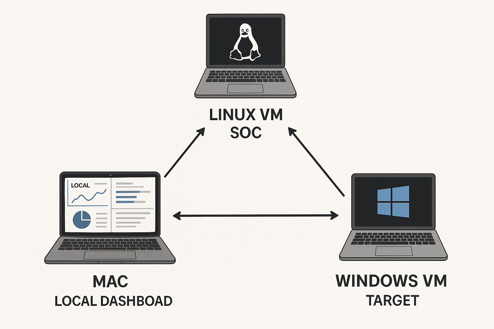

---

## Step 2: Install Wazuh SIEM

On the **host where you want to install Wazuh SIEM**, connect to the Internet and open the following page:

[https://documentation.wazuh.com/current/deployment-options/docker/docker-installation.html](https://documentation.wazuh.com/current/deployment-options/docker/docker-installation.html)

Follow the instructions to install Docker and then Wazuh (manager, indexer, and dashboard) inside a Docker container.

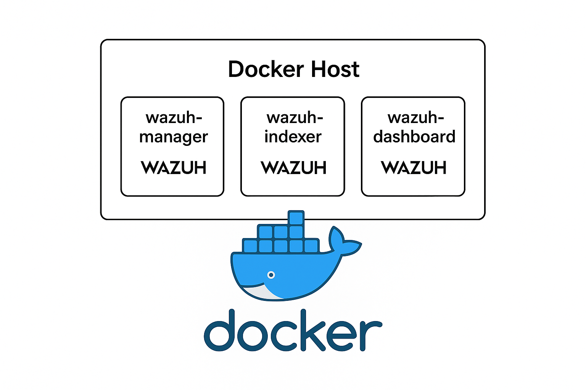

---

## Step 3: Deploy Wazuh Agent

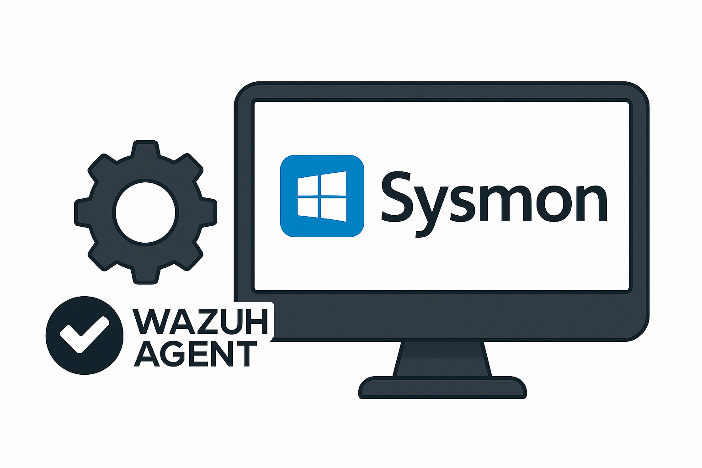

1. Follow the official guide to install the agent on Windows: [https://documentation.wazuh.com/current/installation-guide/wazuh-agent/wazuh-agent-package-windows.html](https://documentation.wazuh.com/current/installation-guide/wazuh-agent/wazuh-agent-package-windows.html)
2. To capture **all** events, install Sysmon and configure the agent to forward Sysmon logs:

   * Blog guide: [https://wazuh.com/blog/using-wazuh-to-monitor-sysmon-events/](https://wazuh.com/blog/using-wazuh-to-monitor-sysmon-events/)
   * Direct download: [https://learn.microsoft.com/en-us/sysinternals/downloads/sysmon](https://learn.microsoft.com/en-us/sysinternals/downloads/sysmon)
3. Example configuration files used in this project are available here: [https://github.com/Krasnomakov/soc_config/tree/main/Windows target VM Configs](https://github.com/Krasnomakov/soc_config/tree/main/Windows%20target%20VM%20Configs)

> **Tip:** You can also run Sysmon on Linux if you wish.

---

## Step 4: Install Snort IDS

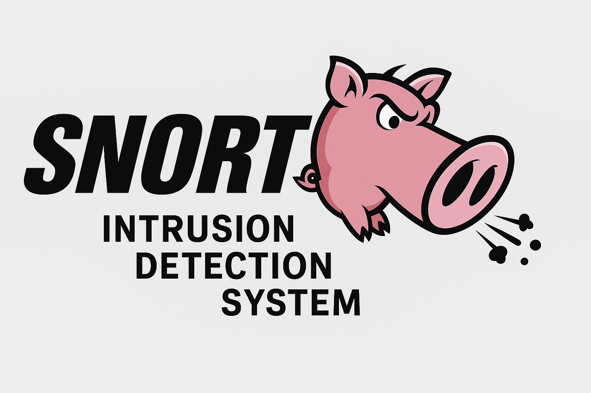

The following guide installs **Snort 3** from source on Ubuntu 22.04.

For background information, visit the official site: [https://www.snort.org](https://www.snort.org).

<details>
<summary><strong>4.1 Install required dependencies</strong></summary>

```bash
sudo apt update
sudo apt install -y \
  build-essential libpcap-dev libpcre3-dev libdumbnet-dev bison flex zlib1g-dev \
  liblzma-dev openssl libssl-dev libnghttp2-dev libhwloc-dev cmake \
  libluajit-5.1-dev pkg-config libtool git autoconf
```

</details>

<details>
<summary><strong>4.2 Build and install libdaq</strong></summary>

```bash
git clone https://github.com/snort3/libdaq.git
cd libdaq
./bootstrap
./configure
make
sudo make install
cd ..
```

</details>

<details>
<summary><strong>4.3 Build and install Snort 3</strong></summary>

```bash
git clone https://github.com/snort3/snort3.git
cd snort3
mkdir build && cd build
cmake ..
make -j$(nproc)
sudo make install
```

</details>

<details>
<summary><strong>4.4 Update shared‑library cache & verify</strong></summary>

```bash
sudo ldconfig
snort -V  # confirm version
```

</details>

> **Optional:** Create a symlink for convenience: `sudo ln -s /usr/local/bin/snort /usr/sbin/snort`

---

## Step 5: Test Wazuh and Snort

### 5.1 Test Wazuh

At this stage Wazuh manager and agent **must** be running.

1. Replace the agent configuration with the tested `ossec.conf`: [https://github.com/Krasnomakov/soc_config/tree/main/Windows target VM Configs/ossec-agent (Wazuh Agent)](https://github.com/Krasnomakov/soc_config/tree/main/Windows%20target%20VM%20Configs/ossec-agent%20%28Wazuh%20Agent%29)
2. Ensure Sysmon is installed on the target Windows VM using this configuration: [https://github.com/Krasnomakov/soc_config/tree/main/Windows target VM Configs/Sysmon](https://github.com/Krasnomakov/soc_config/tree/main/Windows%20target%20VM%20Configs/Sysmon)
3. Restart the agent and open the Wazuh dashboard.
4. Trigger a test alert by disabling the Security Service and running:

   ```powershell
   powershell.exe -Command "Get-Service"
   ```
5. In the dashboard go to **Threat Intelligence ▶ Threat Hunting** and confirm you see an alert with MITRE ID T1059.

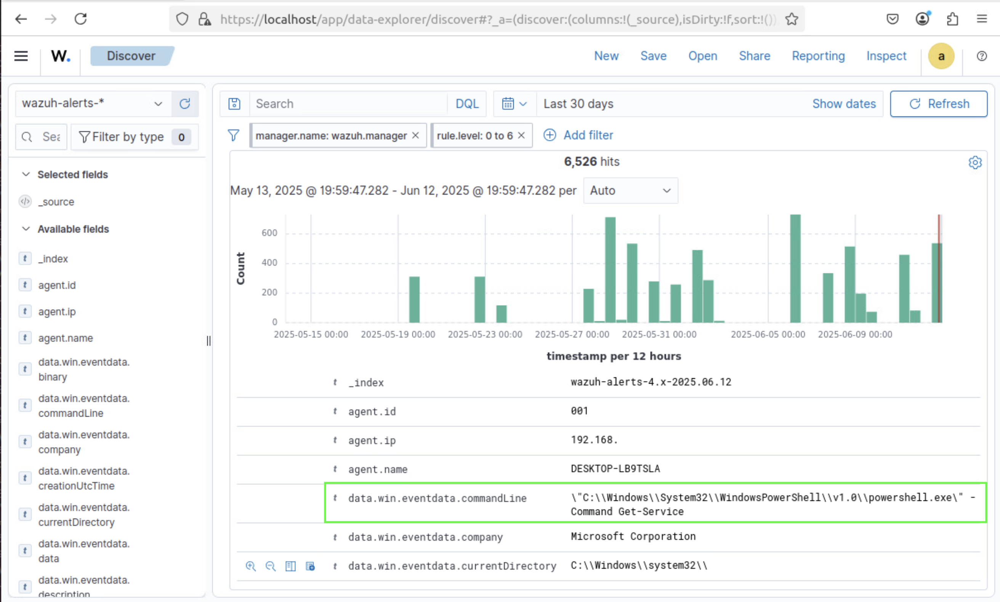

---

### 5.2 Add a custom rule and test it

1. Dashboard ▶ **Server Management ▶ Rules**. Edit `local_rules.xml`.
2. Replace the content with the rules here: [https://github.com/Krasnomakov/soc_config/tree/main/wazuh_rules](https://github.com/Krasnomakov/soc_config/tree/main/wazuh_rules)
3. On the target VM, install `procdump` ([https://learn.microsoft.com/en-us/sysinternals/downloads/procdump](https://learn.microsoft.com/en-us/sysinternals/downloads/procdump)) and place it in `C:\Tools`.
4. Run:

   ```powershell
   .\procdump.exe -m lsass.exe lsass.dmp
   ```
5. Check **Home ▶ Overview** for the new medium‑severity alert.

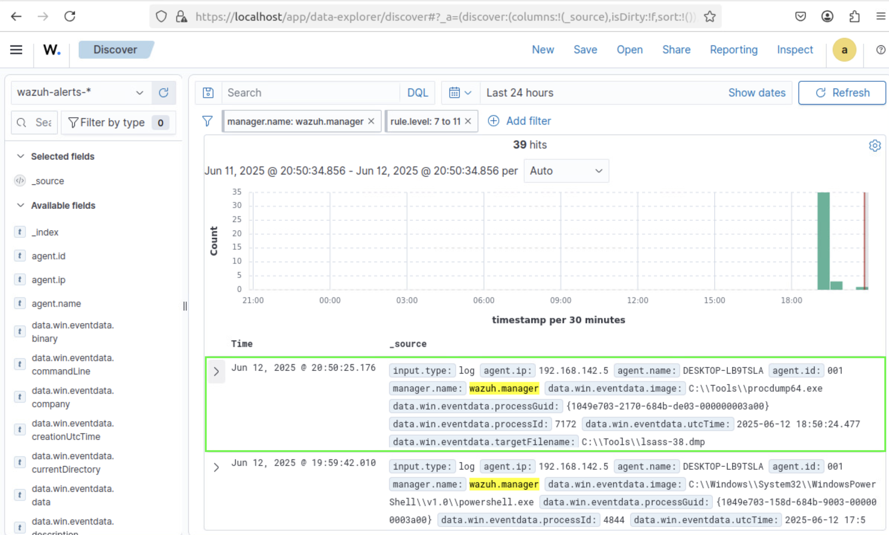

---

### 5.3 Test Snort

1. Identify the interface connected to the monitored network:

   ```bash
   ip addr
   ```

   > In our lab `ens192` was used.

2. Start Snort:

   ```bash
   sudo -S snort -A console -c /etc/snort/snort.conf -i <YOUR_INTERFACE> host <YOUR_TARGET_IP>
   ```

3. In a new terminal install and run an `nmap` scan:

   ```bash
   sudo apt install nmap
   nmap -sS -sV -O <YOUR_TARGET_IP>
   ```

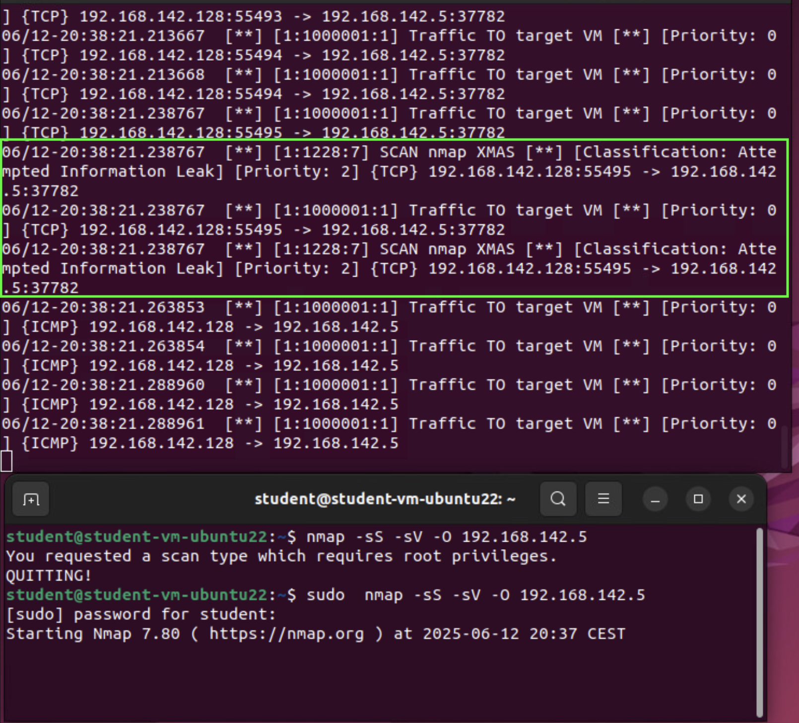

---

## Step 6: Run Alert Stream and Graph Visualizations

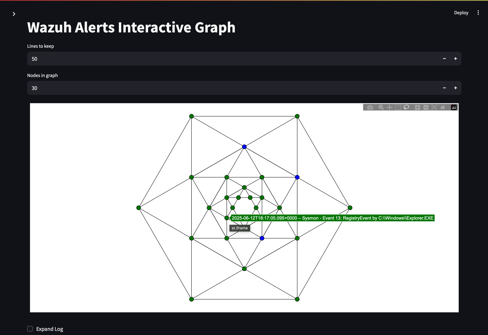

1. Log in to the dashboard and open **Interactive Plot**.
2. Click **Start/Resume** to begin real‑time streaming; nodes will appear in the graph.
3. Hover a node for a tooltip, or click to open full alert details.
4. Adjust the **node limit** above the graph to control density.
5. Open the streaming log beneath the graph; selecting a node highlights the corresponding event.

> **Tip:** Trigger another OS‑credential dump to watch a new blue node appear in real time.

---

### Test Rule‑Level Graphs

Open **Rule Level Graphs** in the sidebar. Two graphs show low‑priority (green) and medium/high‑priority nodes (blue, yellow, red). Use them to spot anomalies.

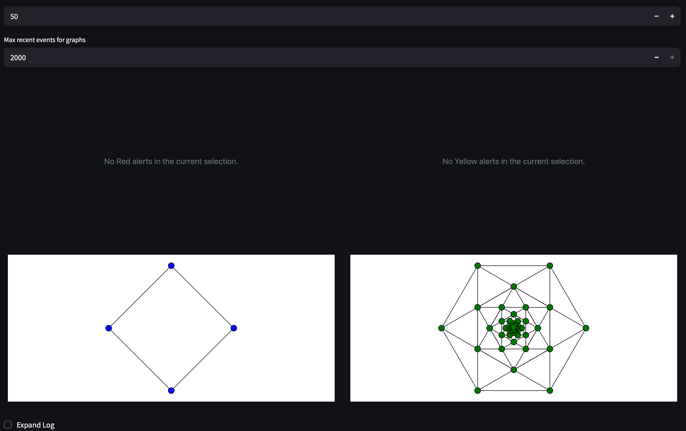

---

## Step 7: Threat Intelligence

SOC Threat Intelligence lets you investigate alerts, retrieve mitigations, and request AI feedback.

### 7.1 MITRE ATT&CK Lookup

1. Sidebar ▶ **Threat Intelligence**.
2. Enter the MITRE ATT&CK ID from an alert and click **Save**.
3. Expand the new case and click **Run MITRE Lookup** to populate tactics, techniques, and mitigations.

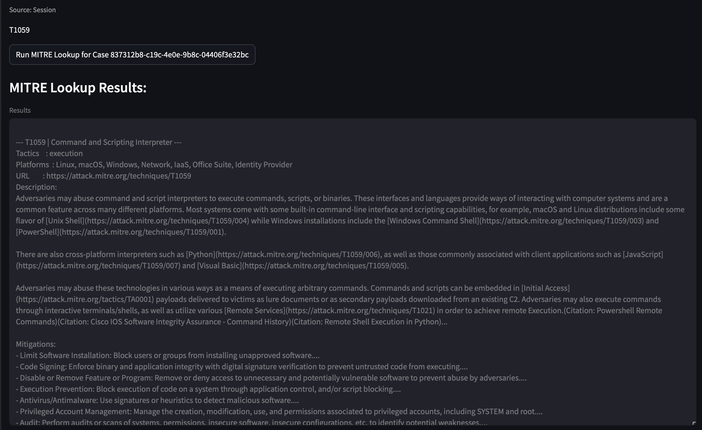

### 7.2 AI Queries

1. Inside a case, click **Query AI**.
2. Requires an **Ollama** server (default model `gemma3:4b`). Install: [https://ollama.ai](https://ollama.ai)

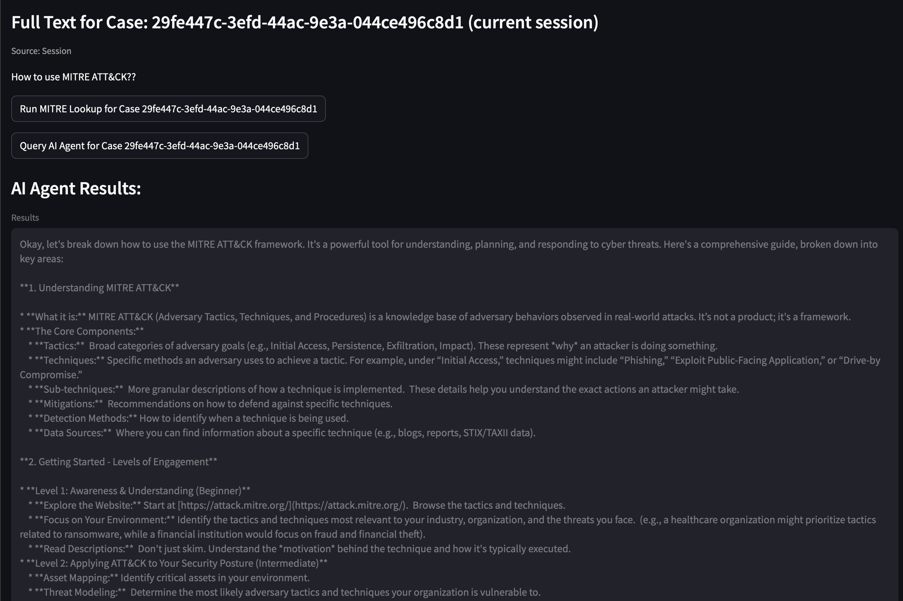

### 7.3 Creating Cases from the Graph

1. Sidebar ▶ **Interactive Plot**. Start streaming.
2. Click a node ➜ pop‑up shows alert details.
3. Scroll down, click the highlighted button to create a draft case.
4. Add a note/question and click **Save Case to CSV**.
5. Open **Threat Intelligence** to continue investigation.

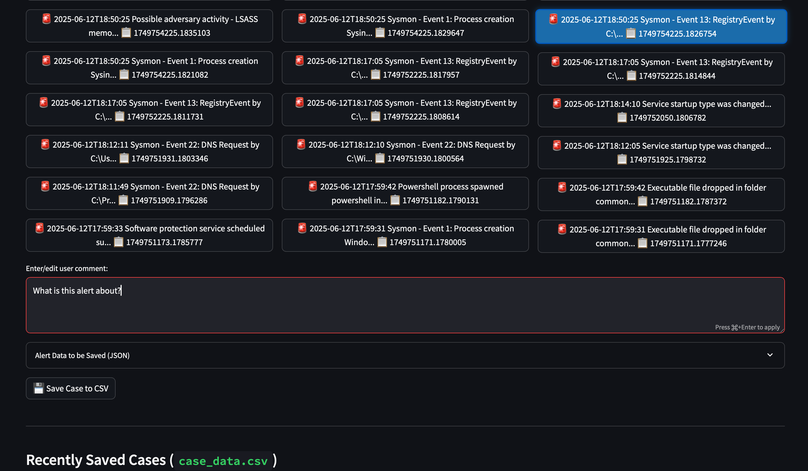

---

## Step 8: Install, Learn and Test MITRE Caldera

1. Install Caldera on the host: [https://github.com/mitre/caldera](https://github.com/mitre/caldera)
2. Run and log in at [http://localhost:8888](http://localhost:8888) (default `admin/admin`).

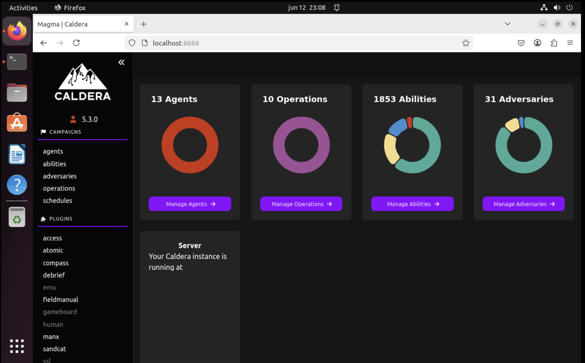

Inside the dashboard, navigate to **Plugins ▶ training ▶ User Certificate** and complete the tutorial to learn the basics.

---

## Step 9: Run a Red Operation

Deploy a **Sandcat agent** on the Windows target and run a *Discovery* operation. Watch yellow nodes emerge on the graph and investigate them via **Threat Intelligence**.

> **Success:** A functional Wazuh setup should capture all basic abilities executed by the agent.

---

## Step 10: Run a Blue Operation

Deploy a **Blue Sandcat agent** on the Windows target and run *Response Training*. Observe the defensive actions in Wazuh alerts and on the graph.

---

## Step 11: Emulate APT

Advanced Persistent Threat (APT) campaigns are long‑running, stealthy attacks. Ensure agents are deployed, then use the **Caldera Emulator** page (sidebar) to launch a scripted APT.

```bash
# Example placeholder – replace with your own script
docker exec caldera python /opt/caldera/scripts/attack_launch_script.py
```

> **Warning:** Run the emulator only in disposable lab environments. Actual script is not provided in this repo. Leave an issue for access request.

Use Wazuh dashboards and Blue agents to monitor and respond.

---

## Step 12: Exercise and keep the SOC alive! 🎉

Congratulations — you have completed the getting‑started guide!

* Explore additional rules, triage workflows, and offense chaining.
* Extend visibility with packet sniffing or additional SIEM/IDS tools.
* Keep the host and dashboard separate; distribute SOC components.

**Keep the SOC alive and keep learning!**
